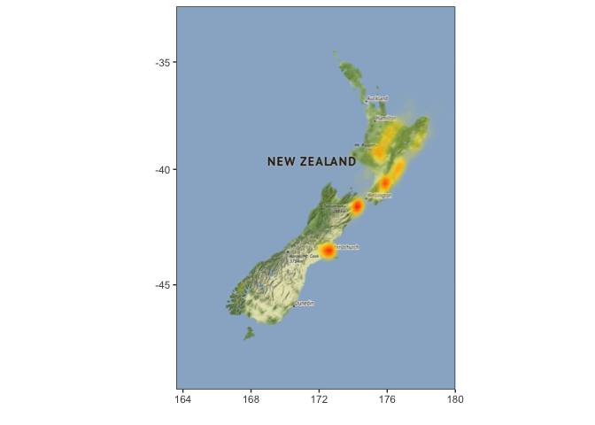
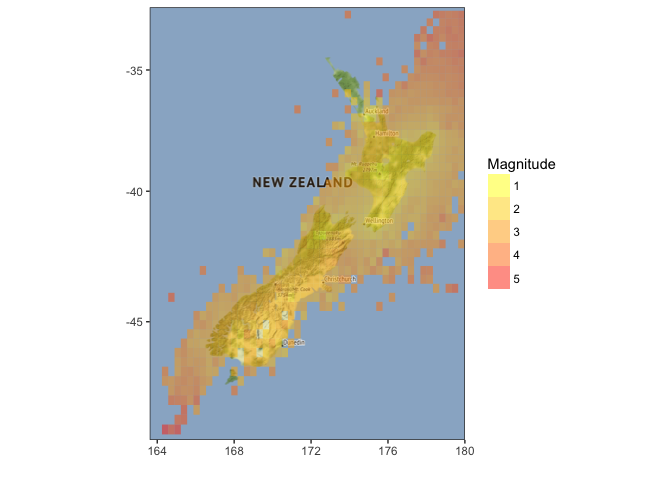
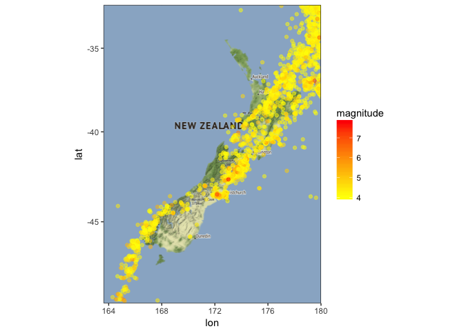
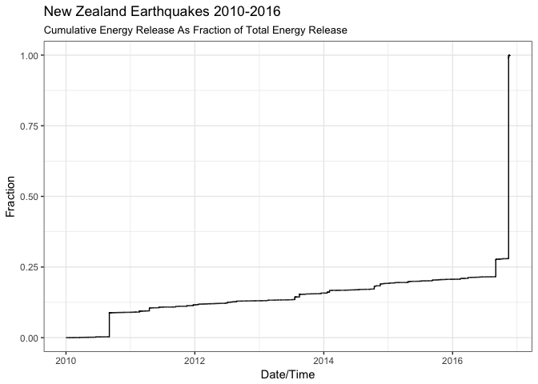
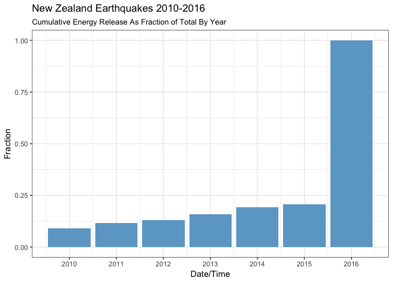

Easy earthquake mapping using ggmap
================
Neil Saunders
2018-04-04 20:18:09

-   [Introduction](#introduction)
-   [Getting earthquake data](#getting-earthquake-data)
-   [Mapping earthquakes](#mapping-earthquakes)
    -   [Mapping by count](#mapping-by-count)
    -   [Mapping by magnitude](#mapping-by-magnitude)
-   [Earthquake energy](#earthquake-energy)

Introduction
------------

This document was inspired by the recent [large earthquake in New Zealand](https://en.wikipedia.org/wiki/2016_Kaikoura_earthquake) (14 November 2016). [This article in Stuff](http://www.stuff.co.nz/national/86458731/Cheviot-earthquake-Tracing-the-source-of-the-7-5-magnitude-quake-and-its-aftermath) claims that the earthquake released as much energy as all earthquakes from the previous 6 years combined. It also illustrates this using a pie chart.

Clearly this is a terrible idea. Whilst [some might seek to justify](http://ellisp.github.io/blog/2016/11/15/piecharts) the pie chart based on the "one dominant observation" argument:

-   it is entirely unsuitable for events over time, even if the slices are in some kind of chronological order...
-   "earlier 2016" versus one date in 2016? Please no.

Surely we can do better.

Getting earthquake data
-----------------------

Sources of publicly-available earthquake data include [NZ GeoNet](http://quakesearch.geonet.org.nz/) and the [USGS earthquake site](http://earthquake.usgs.gov/earthquakes/search/). USGS API queries appear to be limited to magnitude 2.5+ (even when smaller magnitudes are specified). So we use the GeoNet website to obtain URLs for data from 2010 - present, then combine into one large data frame.

Mapping earthquakes
-------------------

First we need a map of New Zealand. This is fairly straightforward using *ggmap*.

### Mapping by count

We can plot earthquake density over the last 6 years using *stat\_density\_2d*. The syntax looks a little weird but the key thing to remember is that if data is not mapped to a third variable, then the density of all observations (= earthquakes) is plotted.

We might speculate that the highest density of earthquake activity corresponds with major faults. The map on [this web page](https://www.gns.cri.nz/Home/Learning/Science-Topics/Earthquakes/Major-Faults-in-New-Zealand) confirms that to be the case.

### Mapping by magnitude

To map by magnitude we create a new base map. We can first try using bins and tiles to display magnitude:

This is not very satisfactory (bins do not capture all events), although it does suggest the larger earthquakes tend to occur in the ocean at the northern and southern tips of the country. It might be easier to use points, but limit the earthquakes to those above a certain magnitude. Let's try 4.

This shows the recent strong earthquakes in the Canterbury region, including the 2016 Kaikoura earthquake (the red dot north-east of Christchurch).

Earthquake energy
-----------------

The Stuff article states that an earthquake of magnitude 7.5 releases about 12 quadrillion joules of energy. Let's run that through the equation for estimating energy found at [this website](http://www.convertalot.com/earthquake_power__calculator.html).

    ## [1] 1.122018e+16

That more or less matches the statement. However, note that the Kaikoura earthquake was upgraded to magnitude 7.8.

Is it possible that one earthquake could release equivalent energy to all earthquakes in the previous 6 years? The key to understanding the problem is that a 1-unit increase on the [Richter scale](https://en.wikipedia.org/wiki/Richter_magnitude_scale) corresponds to a 10-fold increase in shaking amplitude, and a 31.6-fold increase in energy release.

    ## [1] 0.7142125

So in fact the energy from the 2016 Kaikoura earthquake was about 71% of all energy released from earthquakes from the beginning of 2010 up to and including that event. Using the original estimate of magnitude 7.5 generates an estimate of 45%, close to the 48.99% shown in the original pie chart.

Now: how better to represent this than a pie chart? One way might be to calculate a running total (cumulative sum) of energy released and divide the energy for each earthquake by the total.

Informative but not hugely-compelling. Aggregation by year?

The chart illustrates that the majority of energy was released in 2016, but does not indicate the Kaikoura earthquake as the major source and again, is not especially compelling.
